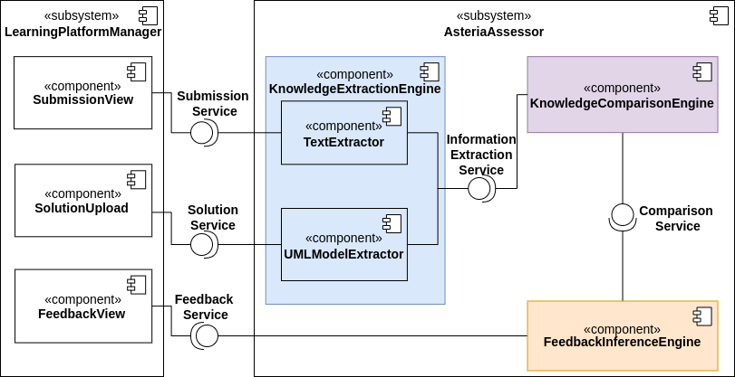
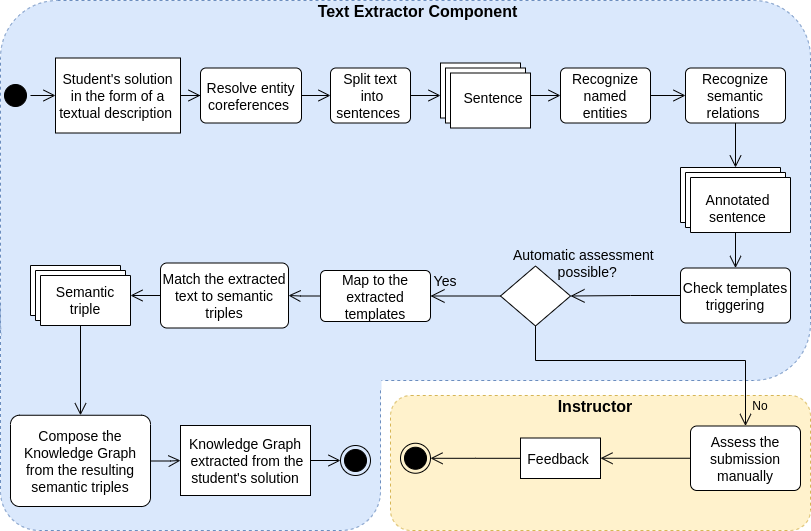
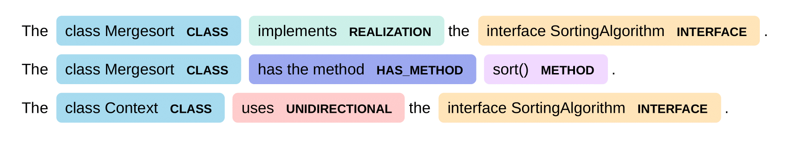
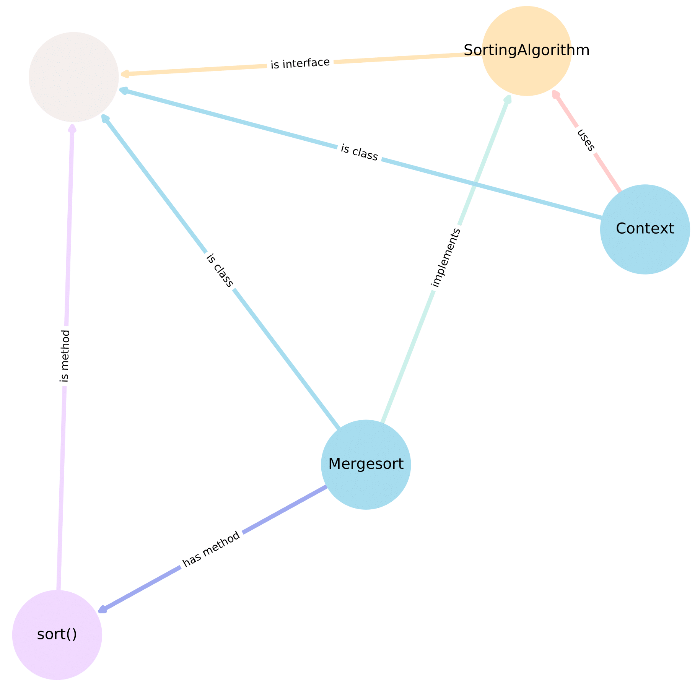
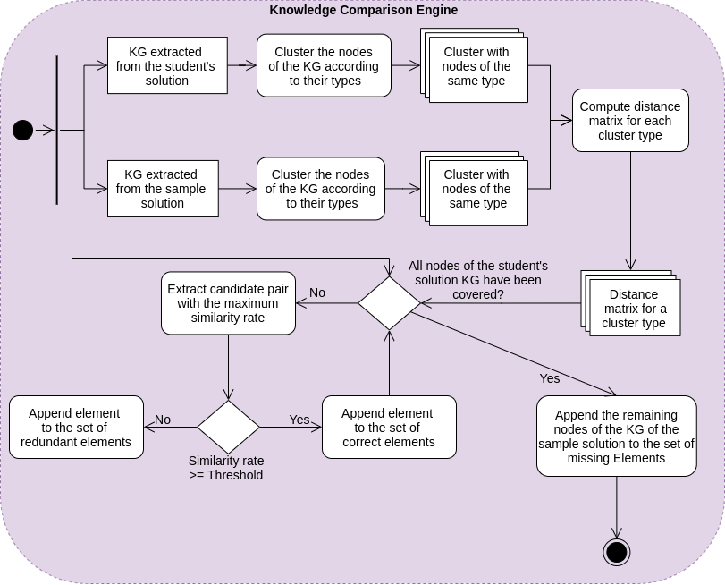

# Asteria - A system to support the automated assessment of textual descriptions of software patterns based on a sample solution depicted in a UML class diagram

This system implements an approach for thr automated assessment of textual descriptions of software patterns using the
Knowledge Graph(KG) data structure and can be integrated into learning management systems (LMS).

# Table of Contents

* [Architecture](#Architecture)
* [Text-Processing-Pipeline](#Text-Processing-Pipeline)
* [Text-Extractor-Component](#Text-Extractor-Component)
* [Knowledge-Comparison-Engine](#Knowledge-Comparison-Engine)
* [Configuration](#Configuration)
* [Usage](#Usage)

# Architecture

The Asteria system is built-in as a standalone system. It can be plugged into any e-learning platform that manages the
data storage and provides the services for uploading the students' solutions and the sample solution and publishing the
generated automated feedback at the end.

The Asteria System comprises three main subsystems:

1. **Knowledge Extraction Engine:** extracts information from the input and saves it in the form of a Knowledge Graph.
   It encompasses two different components:
    1. **Text Extractor:** extracts information from the student's submission given in the form of a text and maps the
       extracted information to a Knowledge Graph.
    2. **UML Model Extractor:** extracts relevant information from the sample solution depicted in a UML class diagram
       uploaded by the instructor and maps the extracted information to a Knowledge Graph.


2. **Knowledge Comparison Engine:** carries out an efficient and complete comparison between the KG extracted from the
   textual description and the one extracted from the UML class diagram of the software pattern. As a result, it
   identifies similarities and gaps between the student's solution and the sample solution. It distinguishes correct
   elements of the student's solution. An element is qualified as correct if it matches with a similar element from the
   sample solution. Additionally, it spots redundant or missing elements of the student's solution and classify them as
   incorrect. A redundant element refers to an element of the student's solution with no similar element in the sample
   solution. A missing element is an element of the sample solution for which no similar element from the student's
   solution can be found.


3. **Feedback Inference Engine:** provides feedback based on the comparison results. The automated feedback includes
   praising comments highlighting the correct elements of the student's solution. Additionally, it includes critical
   comments that point out the redundant or missing parts of the student's solution.


<p align="center"><b>Figure 1:</b> Architecture of the Asteria system interacting with a learning platform management system depicted using a UML Component diagram.</p>

# Text-Processing-Pipeline

Figure 1 describes the text processing pipeline, including the various sub-tasks required to achieve the information
extraction from text. At first, the text extractor component performs the entity coreference resolution. Afterward, it
splits the text into a set of stand-alone sentences. Then, it identifies and categorizes named entities and semantic
relations contained in each sentence. This step results thus in a sentence annotated with labels corresponding to the
identified named entities and semantic relations. Based on these annotations, the text extractor verifies for each
sentence whether it fulfills a predefined template.

As soon as all previous steps have been completed for all sentences within the same textual solution, we compute the
ratio of the extracted information. The latter is equal to the ratio of the number of sentences that triggered a
template to the total number of sentences contained in the text. Suppose the calculated ratio is less than 50\%. In that
case, it means that the text extractor component potentially failed to extract a considerable amount of information.
Therefore, the designed system will not be able to provide thorough feedback that covers most of the parts of the
student's solution. It is best to forward such submissions to a tutor to get them assessed manually in order to ensure a
good quality assessment for all submissions.

Otherwise, if the system successfully extracts most of the important parts of the student's solution, we proceed with
the automatic assessment. Thereby, we locate the fillers of templates in each sentence, extract them and formalize the
extracted text units into semantic triples. The resulting semantic triples are the elementary component of the Knowledge
Graph extracted from the student's solution.


<p align="center"><b>Figure 2:</b> Pipeline of the text processing pipeline depicted using a UML Activity diagram.</p>

# Text-Extractor-Component

Information extraction entails arranging words of the unstructured text in structured categories. It consists of
locating significant objects in text, categorizing them in predefined classes, and annotating the text with the
corresponding label. This subtask is widely known in NLP under the name of Named Entity Recognition NER. To this end, we
define a new entity by specifying its label and a list of matching patterns. Patterns are defined based on grammatical (
e.g., Lemmatization, Stemming), orthographic (e.g, capitalization), syntactic (e.g., words precedence, \ac{POS} tags),
and semantic features (e.g., \ac{NER}) of tokens in the text. Once all patterns for the required entities are specified,
we feed them to the spaCy's Matcher. The latter detects text spans that match a given pattern and their corresponding
tags. When a pattern is fulfilled, the spaCy's Matcher initiates an action. This action involves attaching a tag to the
handled span of the text and setting the entity boundaries by marking the start and the end of the entity label. At this
point, we obtain a text annotated with the custom NER labels.

Similarly, through hand-crafted patterns, we recognize and classify semantic relations. The figure below illustrates an
example of a textual description of a software pattern annotated with our custom information extractor.


<p align="center"><b>Figure 3:</b> Visualization of an example of a text annotated by our developed system with named entities and semantic relations.</p>

For the next step, we adopt a template-driven approach to extract essential information from the textual submission.
First, we set templates schemes using the entities' labels defined in the previous step. For instance, consider a
sentence describing a class implementing an interface. Then the sentence should contain one entity with label CLASS and
another of label INTERFACE separated by a relation with label REALIZATION. We formalize this idea in the form of a
template. Afterward, we check for each sentence of the text if it triggers a template or not. If it does, then we
extract the slots of the sentence that fills the scheme. Subsequently, we map the extracted templates into their
associated semantic triples. As soon as these steps have been carried out, we obtain a set of semantic triples
representing the information extracted from the textual submission. Finally, we put together the resulting semantic
triples in a Knowledge Graph. Figure 4 below shows the Knowledge Graph extracted by our system from the textual
description presented in Figure 3.


<p align="center"><b>Figure 4:</b> Visualization of an example of a Knowledge Graph extracted from a textual description of a software pattern. The visualized graph represents the same text used in figure 3. </p>

# Knowledge-Comparison-Engine

Figure 5 below gives an overview of the general workflow of the knowledge comparison engine. The latter takes as input
two Knowledge Graphs, identifies similarities and differences between them and produces at the end three sets: set of
correct elements, set of missing elements, and set of redundant elements.

<p align="center"><b>Figure 5:</b> Knowledge comparison engine depicted using a UML Activity diagram.</p>

# Configuration

For configuration of the Asteria system you can make use of the environment.yml file in the repository. All requirements
for bringing the system to run locally are included in the requirements.txt file.

* If you want to adjust the patterns of the named entities, relations, or extracted templates, you just have to adjust
  their corresponding files entity_pattern_builder.py , relation_pattern_builder.py , or templates_builder.py
  respectively.


* If you want to adjust the weights of the similarity elements, you just have to adjust the similarity_options.py file.

# Usage

The Asteria system can be executed from command line as following:

* If you want to generate the automated feedback for a single student's solution given a sample solution and save the
  automated feedback in a folder, run the main.py as follows:

```
./src/main.py --UMLModel "PATH/TO/SAMPLE_SOLUTION.json" --TextSolution "PATH/TO/STUDENT_SOLUTION.txt" --dir "DIRECTORY/SAVE/AUTOMATED_FEEDBACK"
```

* If you want to generate the automated feedback for a bulk of student's solutions given a sample solution and save the
  automated feedback in a folder, run the main.py as follows:

```
./src/main.py --UMLModel "PATH/TO/SAMPLE_SOLUTION.json" -all "PATH/TO/DIRECTORY_STUDENT_SOLUTIONS" --dir "DIRECTORY/SAVE/AUTOMATED_FEEDBACK"
```


